Prktikum 1
Membuat Project Flutter Baru
langkah 1
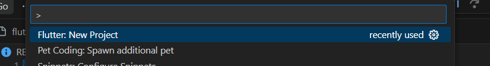
langkah 2
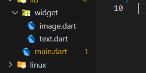
langkah 3
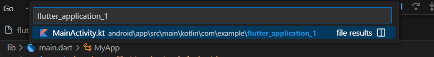
langkah 4
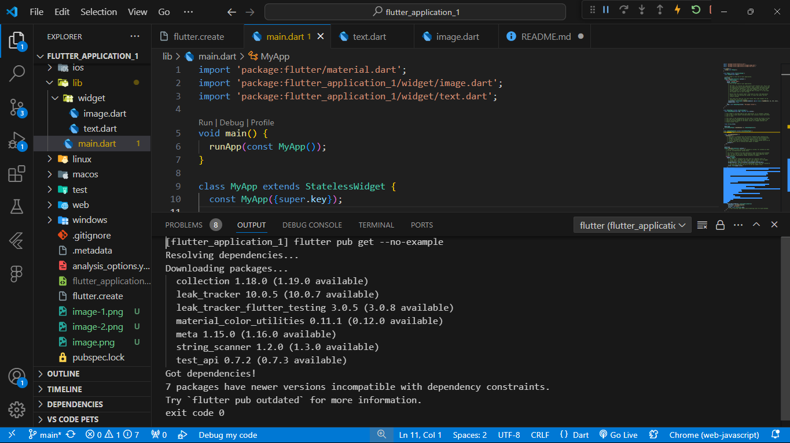

Praktikum 2
Membuat Repository GitHub dan Laporan Praktikum
Hasil Repository Github
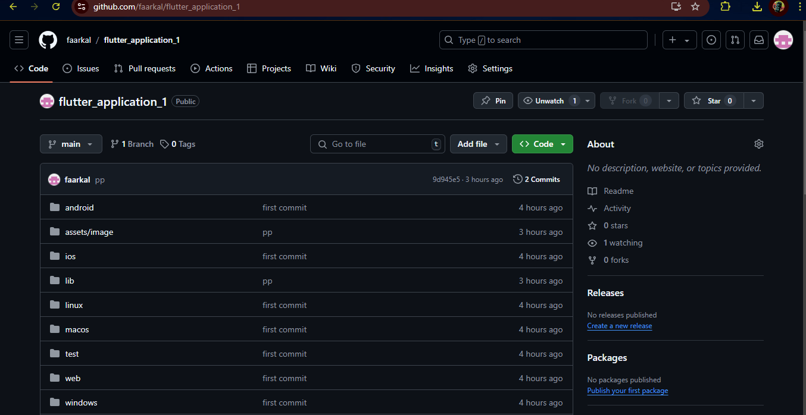
Hasil Praktikum
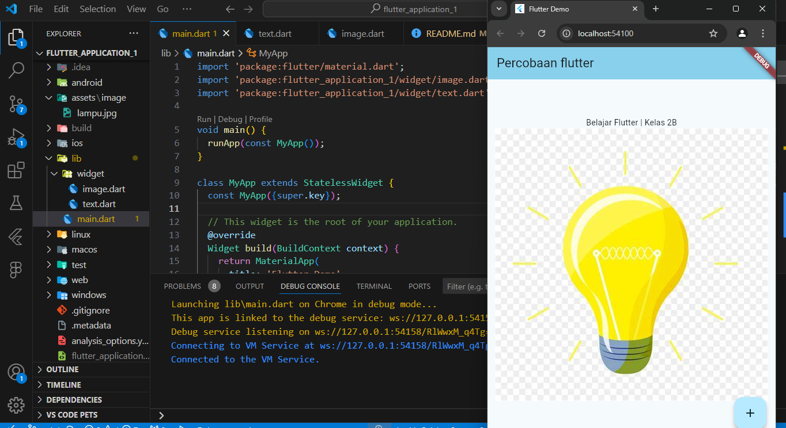

Praktikum 3
Menerapkan Widget Dasar
Text Widget
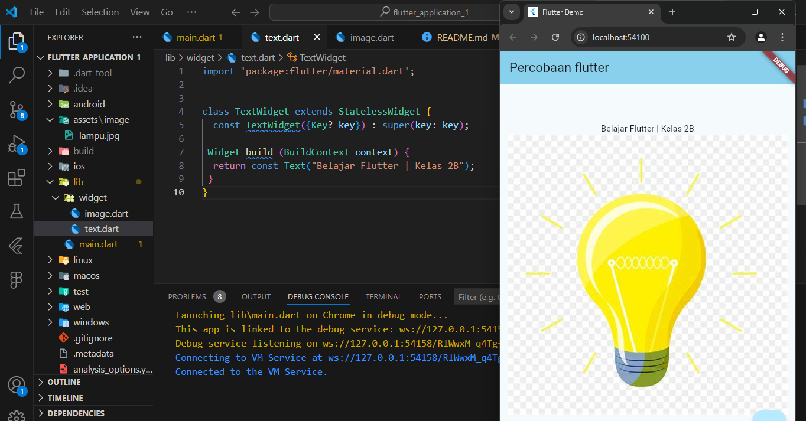
Image Widget
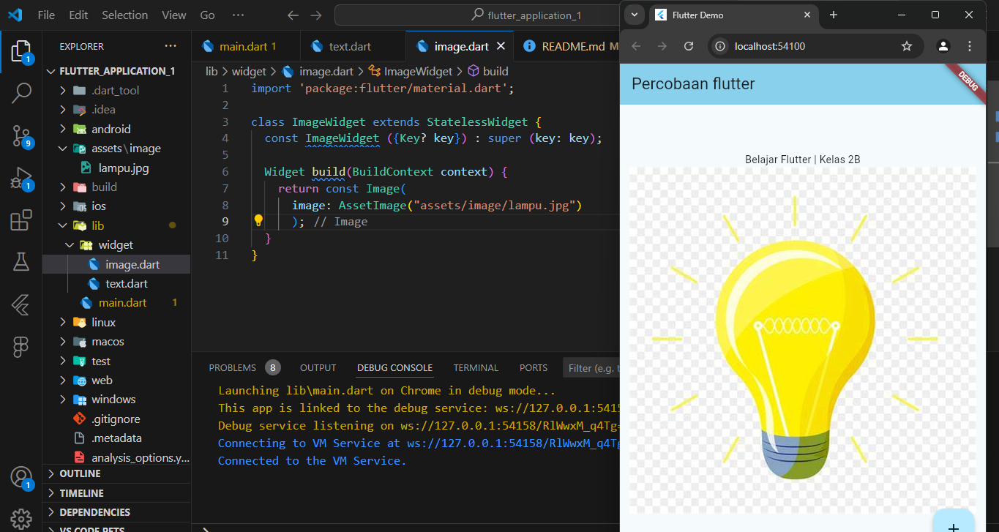

Praktikum 4
Menerapkan Widget Material Design dan iOS Cupertino
Langkah 1: Cupertino Button dan Loading Bar
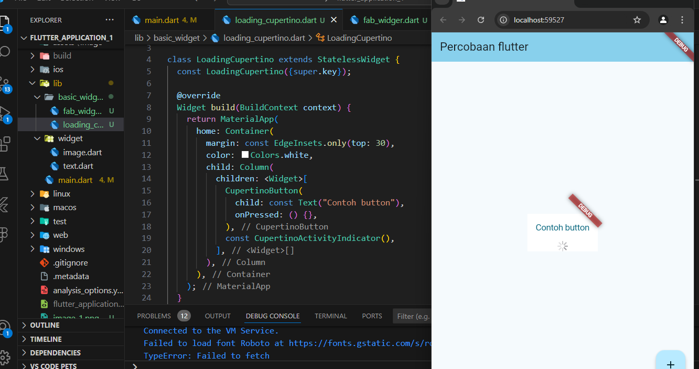
Langkah 2: Floating Action Button (FAB)
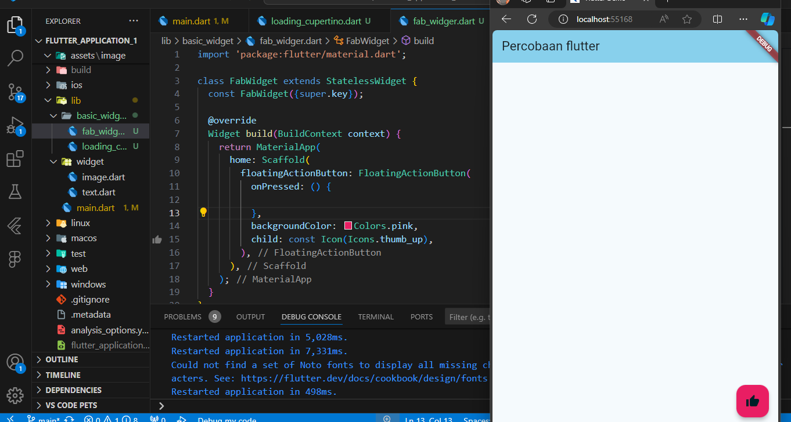
Langkah 3: Scaffold Widget
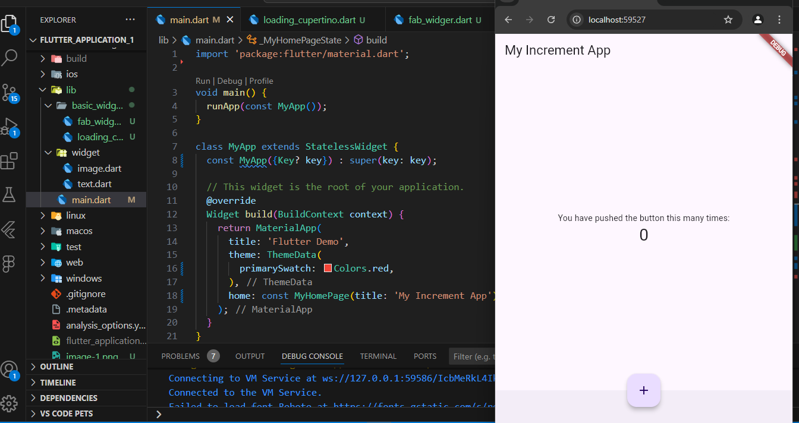
Langkah 4: Dialog Widget
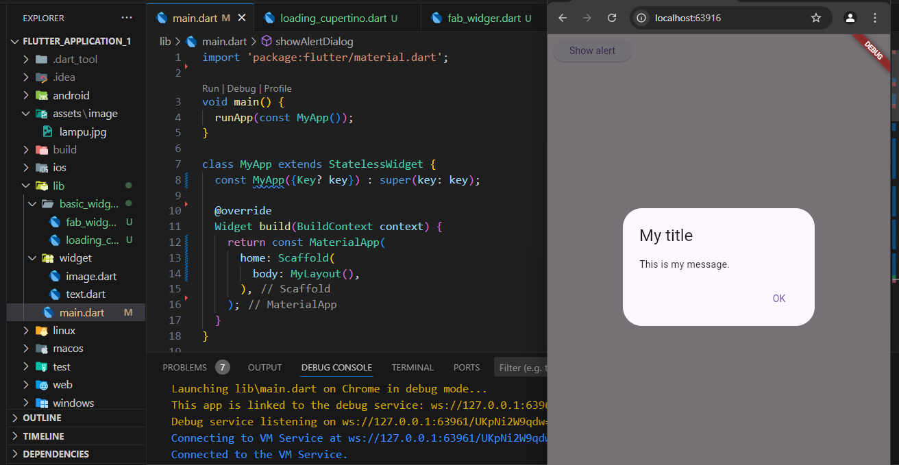
Langkah 5: Input dan Selection Widget
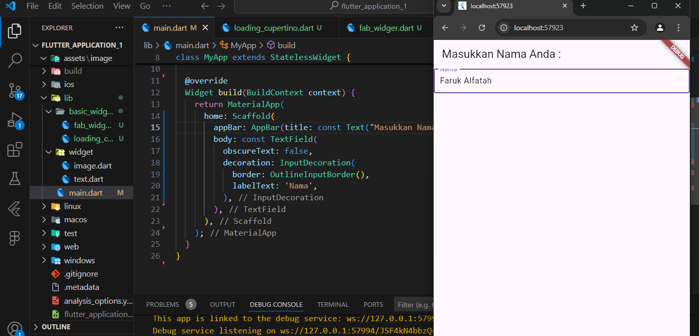
Langkah 6: Date and Time Pickers
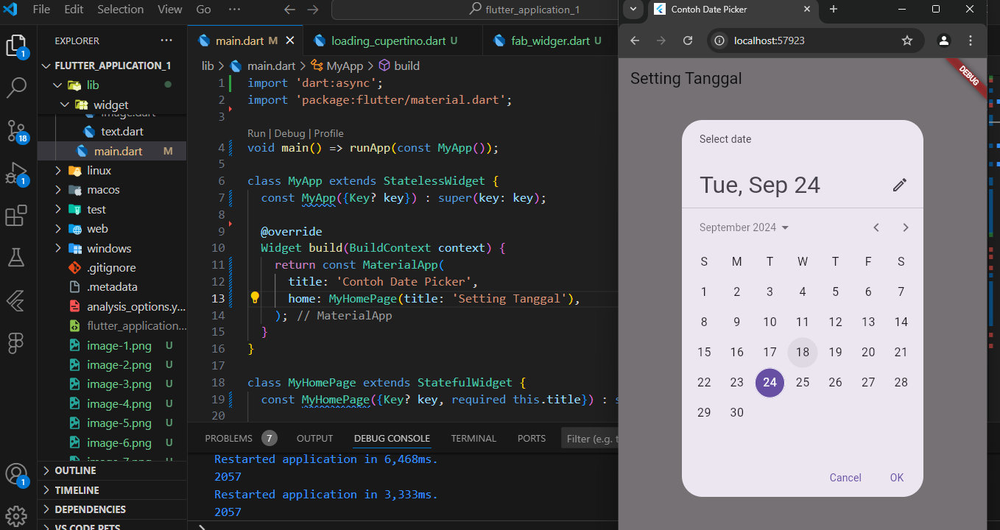